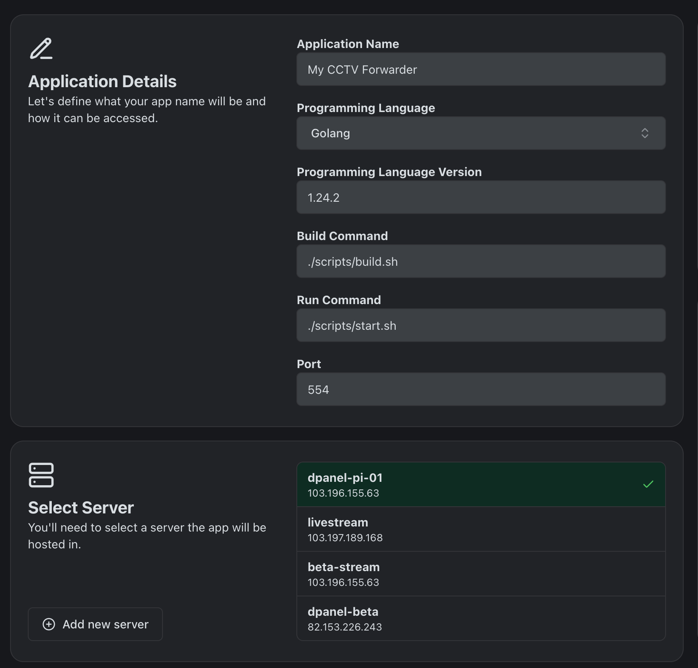
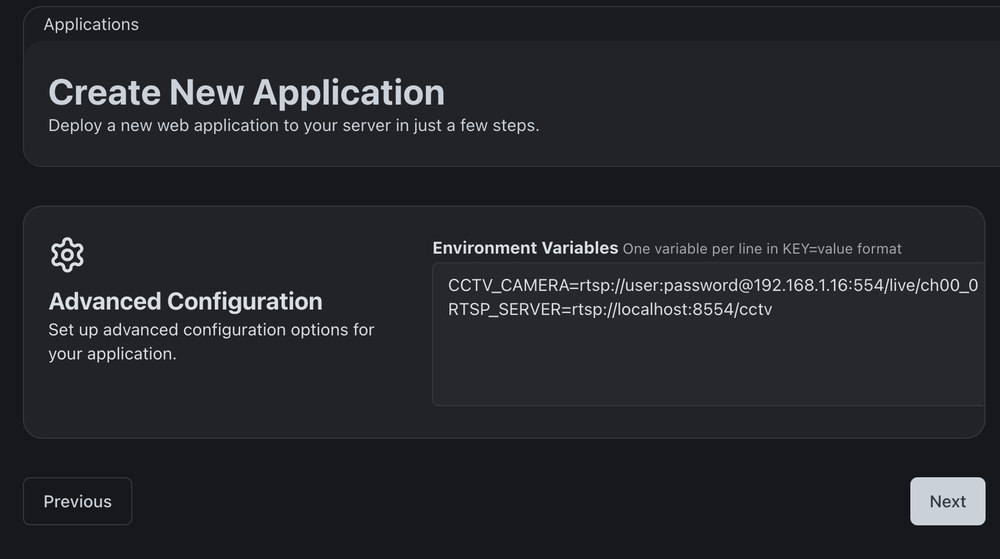

# FFMPEG CCTV READER

Forward CCTV stream to RTSP server with FFMPEG, and expose it with MediaMTX.

## Prerequisites
- [FFMPEG](https://ffmpeg.org/download.html)
- [MediaMTX](https://github.com/bluenviron/mediamtx)

## Installation
1. Register dPanel account at [https://cloud.terpusat.com/](https://cloud.terpusat.com/).
2. Create a new application at [https://cloud.terpusat.com/application](https://cloud.terpusat.com/application).
3. Select this repository as the application source.

4. Set the application data follow the image below:

4. Set the application environment variables:
    - `CCTV_CAMERA`: CCTV stream URL.
    - `RTSP_SERVER`: RTSP server URL.

5. Click "Deploy".

