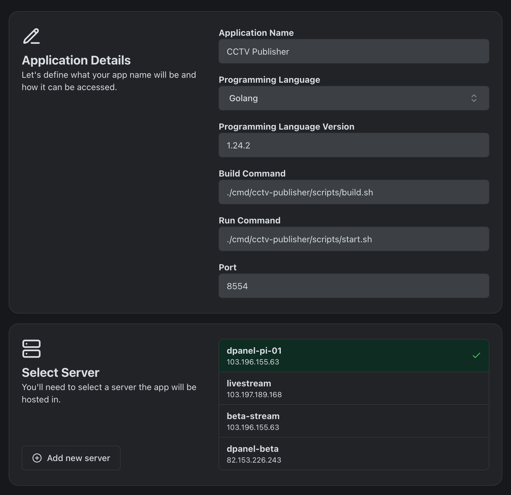
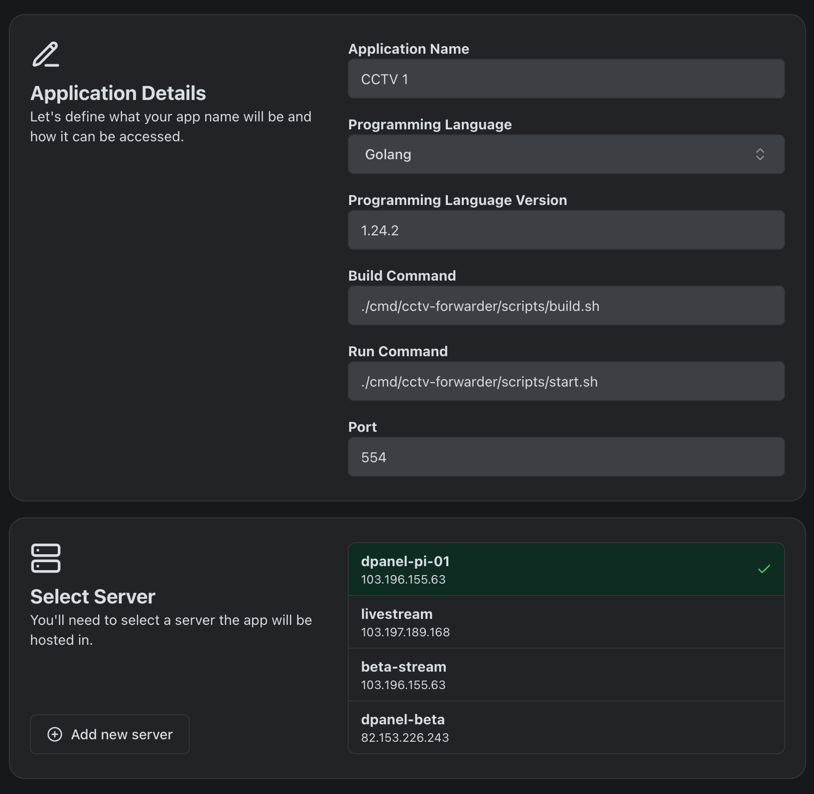
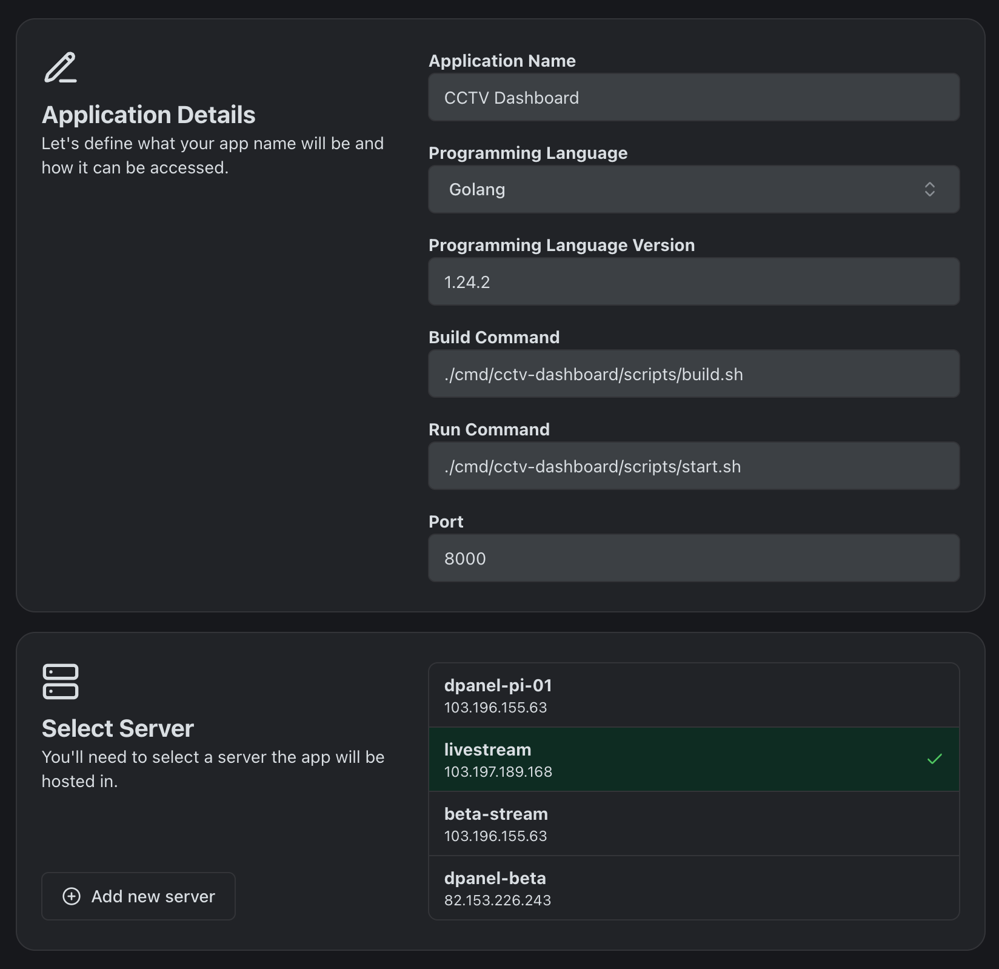
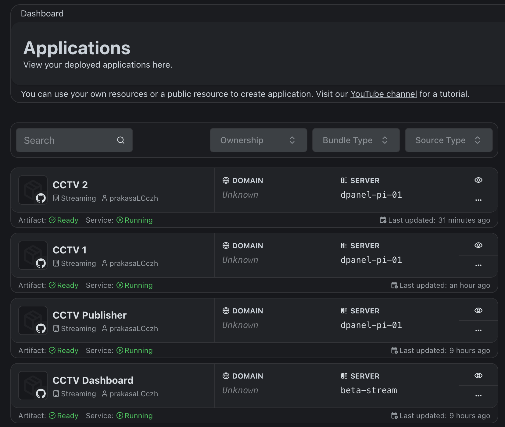

# FFMPEG CCTV READER

Forward CCTV stream to RTSP server with FFMPEG, and expose it with MediaMTX.

## Prerequisites
- [FFMPEG](https://ffmpeg.org/download.html)
- [MediaMTX](https://github.com/bluenviron/mediamtx)

## Installation
1. Register dPanel account at [https://cloud.terpusat.com/](https://cloud.terpusat.com/).
2. Create application for each components at [https://cloud.terpusat.com/application](https://cloud.terpusat.com/application).
3. Select this repository as source for each component (**Media Server, CCTV Camera, CCTV Dashboard**).

3. Set the application data for Media Server:

4. Set the application data for each CCTV camera:

5. Set the application environment variables for each CCTV camera:
    - `CCTV_CAMERA`: CCTV stream URL.
    - `RTSP_SERVER`: RTSP server URL.

6. Set application data for CCTV Dashboard:

7. Click "Deploy" for each component.

8. Check the application status.

## Appendix

This CCTV ecosystem runs under tunnel server and client installed in VPS and Raspberry Pi through dPanel. You can buy VPS from any provider, but we recommend [BiznetGio](https://biznetgio.com/) with IDR 50K/month. Then, install dPanel tunnel server in the VPS:
- Tunnel Server: [https://github.com/devetek/tunnel-server](https://github.com/devetek/tunnel-server)

Now, you can install dPanel tunnel client in your local machine (Raspberry Pi):
- Tunnel Client: [https://github.com/devetek/tuman](https://github.com/devetek/tuman)

Or you can use public tunnel service if any.

Last but not least. This is just for testing purpose, not production ready!. Do not forget to turn off your CCTV when you leave.